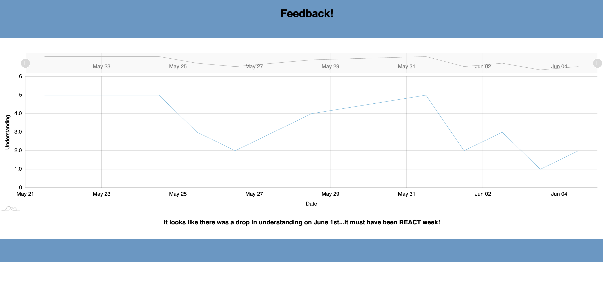

[Repo Size](https://img.shields.io/github/languages/code-size/mmettille/redux-feedback-form.svg?style=for-the-badge)   
    
# Redux Feedback Form

## Table of Contents

- [Description](#description)
- [Screenshots](#screenshots)
- [Built With](#built-with)
- [Getting Started](#getting-started)
  - [Prerequisites](#prerequisites)
  - [Installation](#installation)
- [Usage](#usage)
- [License](#license)
- [Acknowledgements](#acknowledgements)
- [Contacts](#contacts)

## Description

_Duration: 2 Day Sprint_

A feedback form was built for Prime Digital Academy to assess how their students are processing their immersive education.

## Screenshots

"

## Built With

## Getting Started

This project should be able to run in the your favorite IDE. I used VS code while making it but any should work! If you would like to see a working version of this app, without reproducing the whole project, a deployed version of this app is available at [DEPLOYED VERSION OF APP](https://mmettille-feedback-form.herokuapp.com/#/)

To request new features, technologies, or licenses please open an issue and enter as much detail as you can.

### Prerequisites

- Download PostgresSQL

### Installation

1. Fork the repository
2. Copy the SSH key in the new repository.
3. In your terminal type git clone {paste repo link}
4. Navigate into the repository's folder in your terminal by typing " cd redux-feedback-form "
5. Open VS Code (or your editor of choice) by typing " code . "
6. In the terminal of VS Code, type " npm install " to install all dependencies.
7. Create a database named prime_feedback in PostgresSQL
8. The queries in the database.sql file are set up to create all the necessary tables that you will need to have this app work correctly. Copy and paste those queries in the SQL query of the database you just created and execute those queries.
9. Run " npm run server " in your terminal.
10. Open a second terminal and run " npm run client "

## Usage

Once installed and running it should open in your default browser - if this does not happen, navigate to http://localhost:3000/.

The app was designed to be easy to use. Click on the image at the beginning of the page and then fill out each question.
To view the administrative side of the application, navigate to http://localhost:3000/admin.

## License

<a href="https://choosealicense.com/licenses/mit/">MIT License</a>
## Acknowledgements

Thank you to Prime Digital Academy, especially Dane, for teaching me how to program. I strongly recommend them to anyone in either the Twin Cities or Kansas City area looking to start a career in programming or user experience!

## Contacts

  
